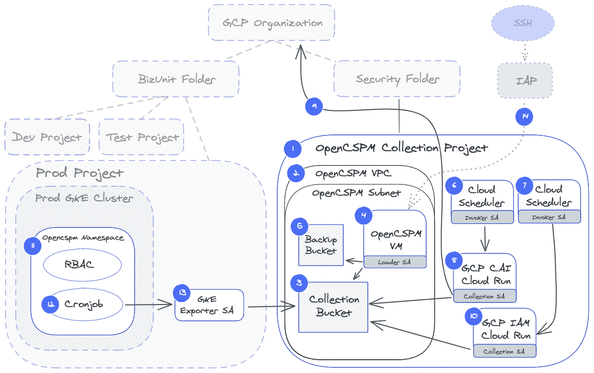

# OpenCSPM GCP Terraform Module
Open Cloud Security Posture Management, [OpenCSPM](https://github.com/OpenCSPM/opencspm), is an open-source platform for gaining deeper insight into your cloud configuration and metadata to help understand and reduce risk over time.  This is the [Terraform](https://terraform.io) module for streamlining the installation of [OpenCSPM](https://github.com/OpenCSPM/opencspm) in your own [Google Cloud](https://cloud.google.com/) Organization.

## Contents

This repository contains multiple Terraform modules:

* **collection/gcp** - Implements the dedicated OpenCSPM Collection Project and all of its contents.  Items #1 through #10 in the diagram below.
* **collection/k8s** - Implements the service accounts and IAM permissions in each project where GKE clusters are deployed.  Intended to be included in your existing Terraform codebase that creates and manages the GKE Clusters.  Item #13 in the diagram below.

Note: The in-cluster resources are deployed via [this manifest template script](https://github.com/OpenCSPM/opencspm/blob/main/collection/k8s-cai-exporter/cronjob.yaml.sh) as Items #11 and #12.

## High-level Architecture



### collection/gcp

1. **OpenCSPM Collection Project** - (main.tf) Creates the GCP Project under the desired Folder ID with data access audit logging enabled and the required APIs enabled.
2. **OpenCSPM VPC and Subnet** - (network.tf) Creates the dedicated VPC in the desired region with a single subnet.  Ingress is limited to SSH from the IAP range only `35.235.240.0/20`.  All egress is denied by default, and `tcp/443` egress to the private Google APIs and Github Repos are all that is permitted. A private DNS zone (dns.tf) redirects `*.googleapis.com` and `*.gcr.io` to the private Google API range.  A cloud router and NAT instance are required for Github access.
3. **Collection Bucket** - (storage.tf) The primary `Data Collection GCS storage bucket` encrypted with KMS.  Has object versioning enabled and a lifecycle policy to move data to cheaper storage class after `60` days and delete after `720` days.
4. **OpenCSPM GCE VM** - (vm.tf) A single GCE Instance running the latest stable [Container-Optimized OS](https://cloud.google.com/container-optimized-os/docs/concepts/features-and-benefits) base image with only a private IP address, restricted OAuth Scopes, a dedicated `Loader Service Account`, and permissions to read/write/decrypt/encrypt to the `Collection` and `Backup Buckets` as well as send logs and metrics to Cloud Logging and Monitoring.
5. **Backup Bucket** - (storage.tf) The OpenCSPM database `backup GCS storage bucket` encrypted with KMS.  Has a lifecycle policy to move data to cheaper storage class after `10` days and delete after `365` days.
6. **Cloud Scheduler - GCP CAI** - (collection.tf) Triggers the **Cloud Run - GCP CAI** container on a configurable schedule using the `Invoker Service Account`.
7. **Cloud Scheduler - GCP IAM** - (collection.tf) Triggers the **Cloud Run - GCP IAM** container on a configurable schedule using the `Invoker Service Account`.
8. **Cloud Run - GCP CAI** - (collection.tf) - Using the `gcr.io/opencspm/gcp-cai-exporter` image, fetches a current inventory and writes/encrypts them to the `Data Collection GCS storage bucket`.
9. **GCP CAI Collection Org Level IAM** - (collection.tf) An organization-level binding of `roles.cloudasset.viewer` on the `Collection Service Account` necessary to gather the [Cloud Asset Inventory](https://cloud.google.com/asset-inventory/docs/overview) of the entire organization.
10. **Cloud Run - GCP IAM** - (collection.tf) Using the `gcr.io/opencspm/gcp-iam-exporter` image, fetches a copy of the latest export of built-in GCP IAM Roles from [https://github.com/darkbitio/gcp-iam-role-permissions/blob/master/gcp_roles_cai.json](https://github.com/darkbitio/gcp-iam-role-permissions/blob/master/gcp_roles_cai.json) and writes/encrypts it to the `Data Collection GCS storage bucket`.

Optional:

14. **External Access** - (iam.tf) Optional granting of permissions to Darkbit to enforce 2FA access using remote [SSH-over-IAP](https://cloud.google.com/iap/docs/using-tcp-forwarding) administration of the `Collection Project` without exposing an SSH daemon via public IP.

#### In-cluster K8s Exporter [Manifest](https://github.com/OpenCSPM/opencspm/blob/main/collection/k8s-cai-exporter/cronjob.yaml.sh)

11. **OpenCSPM Namespace, ServiceAccount, ClusterRole, ClusterRoleBinding** - Creates a dedicated `namespace` called `opencspm` with a dedicated `Kubernetes Service Account` named `opencspm`.  A custom `ClusterRole` allowing `get` and `list` on all API server resources is bound to the `opencspm` `Kubernetes Service Account`.
12. **Cronjob, gcr.io/opencspm/k8s-cai-exporter Image** - A CronJob runs the `k8s-cai-exporter` image on a configurable schedule which collects, sanitizes, and writes/encrypts into the `data collection GCS bucket` in the `OpenCSPM collection project` using the `GKE Exporter Service Account`.

#### collection/k8s

13. **GKE Exporter Service Account** - (main.tf) Creates a `GKE Exporter Service Account` in the same project as the GKE cluster.  Binds the `Kubernetes Service Account` named `opencspm` in the `opencspm` namespace via [Workload Identity](https://cloud.google.com/kubernetes-engine/docs/how-to/workload-identity) to this GCP Service Account and grants permissions to write/encrypt files to the `data collection GCS bucket` in the `OpenCSPM collection project`.

## Example Usage

Consuming these [Terraform modules](https://learn.hashicorp.com/tutorials/terraform/module-use) can be done by adding them to your existing Terraform project(s).  The following shows how to use the `collection/gcp` module to deploy the dedicated OpenCSPM project and resources into your environment.

```terraform
# Add the following to your new or existing Terraform workspace.
module "opencspm-deployment" {
  # A versioned reference to the module repo and subpath
  source = "github.com/opencspm/opencspm-terraform-gcp.git//collection/gcp?ref=0.1.5"

  # Obtain the organization number via gcloud organizations list
  organization_id = "123456789101112"
  # Obtain the desired folder number to create the dedicated OpenCSPM project "under"
  folder_id = "987654321"
  # The billing account ID to attach to the dedicated OpenCSPM project
  billing_account = "1A2B3C-1A2B3C-1A2B3C"

  # The collection bucket name prefix.  Format is: "<this_prefix>-<gcs_region>-opencspm"
  collection_bucket_prefix = "db-collection"
  # The backup bucket name prefix.  Format is: "<this_prefix>-<gcs_region>-opencspm"
  backup_bucket_prefix = "db-backup"
  # The gcr.io hosted paths and version tags of the GCP CAI and GCP IAM exporter images
  cai_exporter_image = "gcr.io/opencspm/gcp-cai-exporter:v0.1.5"
  iam_exporter_image = "gcr.io/opencspm/gcp-iam-exporter:v0.1.2"

  # Change to true if a Darkbit managed client to grant access to this project
  enable_darkbit_administrators = false
}
```

Run `terraform plan` and `terraform apply` when ready.

The following shows how to use the `collection/k8s` module to deploy the necessary service account and permissions in each GCP project where GKE clusters are deployed.

```terraform
# Add the following to your existing Terraform workspace/project where the GKE cluster is managed
module "prod-cluster" {
  # A versioned reference to the module repo and subpath
  source = "github.com/opencspm/opencspm-terraform-gcp.git//collection/k8s?ref=0.1.5"

  # A project id where the GKE cluster(s) lives. e.g. "my-gke-project"
  cluster_project_id     = "<this_project_id>"
  # The generated project_id from the "opencspm-deployment" module where the data collection bucket resides. e.g. "opencspm-collection-672c"
  collection_project_id  = "<collection_project_id>"
  # The full name of the data collection bucket. e.g. "db-collection-us-opencspm"
  collection_bucket_name = "<full_collection_bucket_name>"
  # The namespace and service account name where the k8s-cai-exporter cronjob is running.
  k8s_namespace          = "opencspm"
  k8s_sa_name            = "opencspm"
}
```

Run `terraform plan` and `terraform apply` when ready.  Create a separate module block for each project where GKE clusters are deployed.

Finally, modify the values for the `GKE Exporter ServiceAccount email`, `namespace`, `serviceaccount`, and `GCS Bucket Name` in the [K8s CAI Exporter Manifest](https://github.com/OpenCSPM/opencspm/blob/main/collection/k8s-cai-exporter/cronjob.yaml.sh) to the values above.  Then run `./cronjob.yaml.sh | kubectl apply -f -` against that cluster to install the Cronjob.  Run `./cronjob.yaml.sh | kubectl apply -f -` in each GKE cluster in the project.

## Support and Community

OpenCSPM is undergoing active development.  If you have found an issue, please file it using a GitHub [issue](https://github.com/opencspm/opencspm-terraform-gcp/issues/new/choose).

## Contributing

If you would like to contribute to OpenCSPM, please open a new [issue](https://github.com/opencspm/opencspm-terraform-gcp/issues/new/choose) for pre-approval of the contribution before submitting a pull request.

## Creators

OpenCSPM was made open-source software by [Josh Larsen](https://github.com/joshlarsen) and [Brad Geesaman](https://github.com/bgeesaman), the co-founders of [Darkbit](https://darkbit.io). Darkbit is a cloud-native security assessment consulting firm based in the US that helps organizations understand the risks in their cloud and Kubernetes resource configurations.
